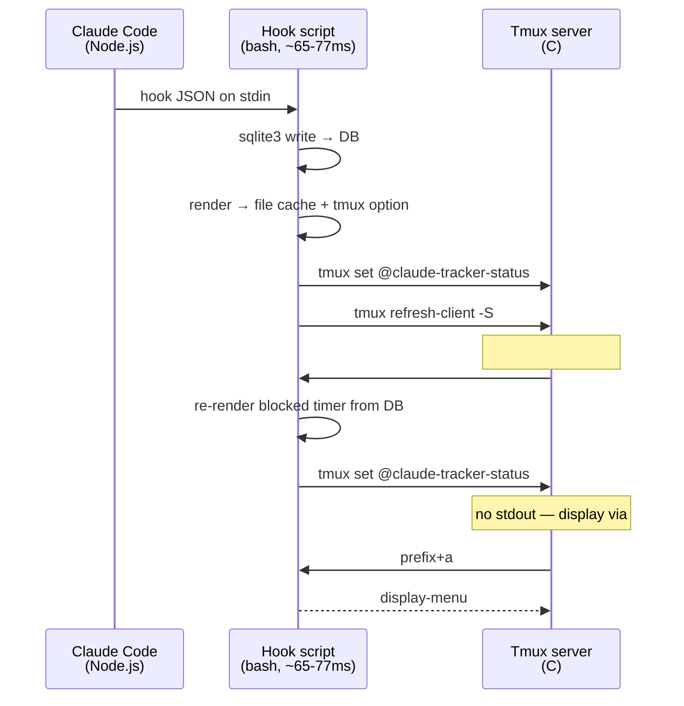
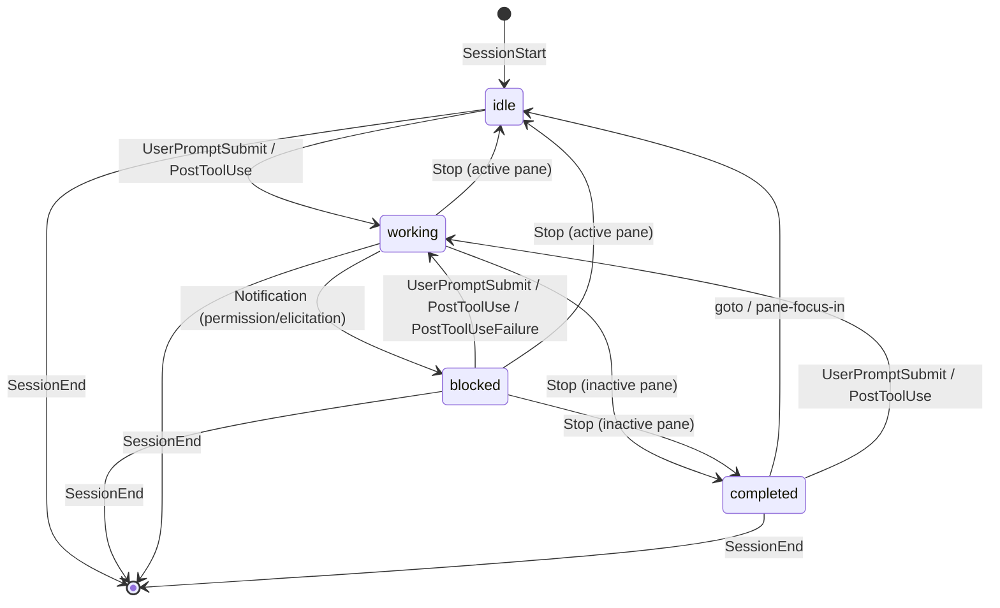

# Architecture

## Process Boundaries



No daemon. Each hook is a fire-and-forget bash process. SQLite is the only shared state.

## Push/Pull Split

**Push (hooks):** Claude event -> write DB -> render to file cache + tmux option -> `refresh-client -S`. The status is pushed to `@claude-tracker-status` via `tmux set`, and `#{@option}` in status-right is re-evaluated immediately on refresh. This eliminates the lag caused by `#()` caching.

**Pull (refresh):** Tmux calls `#(tracker.sh refresh)` every `status-interval` seconds. Re-queries DB (blocked timer recomputation), updates the tmux option. Produces no stdout — display comes from `#{@claude-tracker-status}`.

**Why not `#()`?** Tmux caches `#()` command output for `status-interval` seconds. `refresh-client -S` redraws the status line but does NOT re-evaluate `#()` — it uses the cached output. This caused up to `status-interval` seconds of lag between hook execution and visible status change. Switching to `#{@option}` (a tmux user option) eliminates this because option values are read fresh on every redraw.

Cache file write uses `mv -f` for atomicity. The tmux option is the primary display source; the file cache is a fallback.

## State Machine



Transition guards:
- `SessionStart` -> idle (INSERT OR IGNORE, no-op if session exists)
- `Stop` -> completed or idle (`WHERE status IN ('working', 'blocked')`, no-op on idle/completed; sets idle if pane is active, completed otherwise)
- `UserPromptSubmit` -> working (unconditional, handles idle/completed/blocked->working)
- `PostToolUse` / `PostToolUseFailure` -> working (`WHERE status!='working'`, no-op when already working)
- `Notification` -> blocked (`WHERE status = 'working'`, only from working state; `permission_prompt` or `elicitation_dialog` only)
- `goto` -> idle (`WHERE status='completed'`, clears completed when user focuses pane via menu)
- `pane-focus-in` -> idle (`WHERE status='completed'`, clears completed when user navigates to pane)

## Hook Performance

State-changing hooks run in ~77ms. No-op hooks (e.g. PostToolUse when already working) run in ~65ms.

### Hot path optimizations

PostToolUse and Notification are the most frequent state-changing hooks. They use a combined SQL pattern that does UPDATE + render query in a single sqlite3 call:

```sql
UPDATE sessions SET status='...', updated_at=unixepoch()
    WHERE session_id='...' AND status != '...';
SELECT CASE WHEN changes() = 0 THEN '' ELSE (render query) END;
```

If `changes() = 0`, the hook is a no-op — skip render, skip tmux refresh.

These hooks also skip `_ensure_session` (the session is guaranteed to exist by the time PostToolUse or Notification fires). This eliminates 2 sqlite3 calls from the hot path.

### Config loading

`load_config` (helpers.sh) fetches tmux options and caches them to `$TRACKER_DIR/config_cache`. The full check runs `date` + `stat` to verify freshness (~8ms in subprocesses).

Hook path uses `_load_config_fast` which sources the cache file directly without freshness check. Non-hook paths (status-bar, menu) use the full `load_config` with 60s TTL.

### Cost breakdown (state-changing hook)

| Cost | Source |
|------|--------|
| ~7ms | bash startup + source helpers.sh |
| ~9ms | sqlite3 (combined UPDATE + render) |
| ~5ms | source config cache |
| ~6ms | write cache file (printf + mv) |
| ~3ms | tmux set @claude-tracker-status |
| ~7ms | tmux refresh-client -S |

### Status-interval enforcement

The plugin sets `status-interval` to `@claude-tracker-status-interval` (default 5s) on load, but only lowers it — never overrides a user's shorter custom interval. This ensures the blocked timer refreshes periodically while respecting user preferences.

### Asymmetric transition latency

`blocked → working` (PostToolUse) feels faster than `working → blocked` (Notification) despite identical script execution times. The delay is upstream in Claude Code — there is a gap between when Claude decides it needs permission and when it fires the Notification hook. This is outside the tracker's control.

### What was eliminated

| Removed | Savings |
|---------|---------|
| `jq` (5 calls per hook) | ~15ms (subprocess spawns) |
| `cat` for stdin | ~3ms (replaced with `read -r`) |
| `_ensure_session` on hot path | ~7ms (1 fewer sqlite3) |
| Separate render sqlite3 call | ~8ms (batched into hook SQL) |
| `date`+`stat` in config check | ~8ms (source file directly) |
| render+refresh on no-ops | ~15ms (skip via `SELECT changes()`) |

## Self-Healing (_ensure_session)

Called for session-creating hooks (SessionStart, UserPromptSubmit). Registers the session if missing, backfills tmux pane data if incomplete. Accepts an initial status parameter: SessionStart creates as `idle`, UserPromptSubmit creates as `working`.

Hot-path hooks (PostToolUse, Notification, Stop, TeammateIdle) skip this — their UPDATEs are safe no-ops if the session doesn't exist yet.

Handles: missed SessionStart, lost tracking, missing tmux info.

- `SessionStart`: `INSERT OR REPLACE` (authoritative upsert)
- `_ensure_session`: `INSERT OR IGNORE` (gap-fill only)

## Session Cleanup

Sessions can leak (crashes, killed panes). Three cleanup mechanisms:

1. **SessionEnd hook** (normal exit)
2. **`_reap_dead`** (hook path, throttled to 30s): cross-references `tmux list-panes` with stored pane IDs, deletes dead ones
3. **`cmd_cleanup`** (manual): deletes sessions older than 24h + dead pane check

`_reap_dead` checks pane liveness via `tmux list-panes` and process inspection via `pgrep`. Working/blocked sessions on live panes without a claude child process are cleaned up (Ctrl+C case).

## SQLite as IPC

Multiple concurrent hook processes. WAL mode handles this:

- **WAL mode**: readers never block writers
- **busy_timeout=100ms**: concurrent writes wait instead of failing
- Each `sqlite3` invocation is a new connection

## Scan (Fallback Discovery)

`cmd_scan` finds Claude processes via `pgrep` in tmux panes. Conditional INSERT skips panes already tracked by hooks. Throttled to once per 30s.

## Hook Events

| Hook | Transition | Guard |
|------|-----------|-------|
| SessionStart | (new) -> idle | INSERT OR IGNORE (no-op if session exists) |
| UserPromptSubmit | any -> working | unconditional |
| PostToolUse | blocked/idle/completed -> working | `status!='working'` |
| PostToolUseFailure | blocked/idle/completed -> working | `status!='working'` (catches rejected tools / interrupts) |
| Stop | working/blocked -> completed (or idle if active pane) | `status IN ('working', 'blocked')` (does NOT fire on user interrupt; checks `#{pane_active}`) |
| pane-focus-in | completed -> idle | `status='completed'` AND `tmux_pane` matches focused pane |
| Notification | working -> blocked | `status='working'`, `permission_prompt` or `elicitation_dialog` only |
| SessionEnd | any -> (deleted) | unconditional |
| TeammateIdle | any -> idle | unconditional |

## Database Schema

```sql
CREATE TABLE sessions (
    session_id    TEXT PRIMARY KEY,
    status        TEXT NOT NULL DEFAULT 'working'
        CHECK(status IN ('working', 'blocked', 'idle', 'completed')),
    cwd           TEXT NOT NULL,
    project_name  TEXT NOT NULL,
    git_branch    TEXT,
    prompt_summary TEXT,
    agent_type    TEXT,
    tmux_pane     TEXT,
    tmux_target   TEXT,
    started_at    INTEGER NOT NULL DEFAULT (unixepoch()),
    updated_at    INTEGER NOT NULL DEFAULT (unixepoch())
);
```

## File Structure

```
tmux-claude-agent-tracker/
├── claude-tracker.tmux          # TPM entry point
├── scripts/
│   ├── helpers.sh               # Config loading, tmux helpers
│   └── tracker.sh               # Core: hook, menu, status-bar, goto
├── tests/
│   ├── tracker.bats             # BATS test suite
│   └── helpers.bash             # Test helpers, DB setup, mocks
├── install.sh                   # TPM + manual install
└── bin/
    └── tmux-claude-agent-tracker    # Wrapper -> scripts/tracker.sh
```
