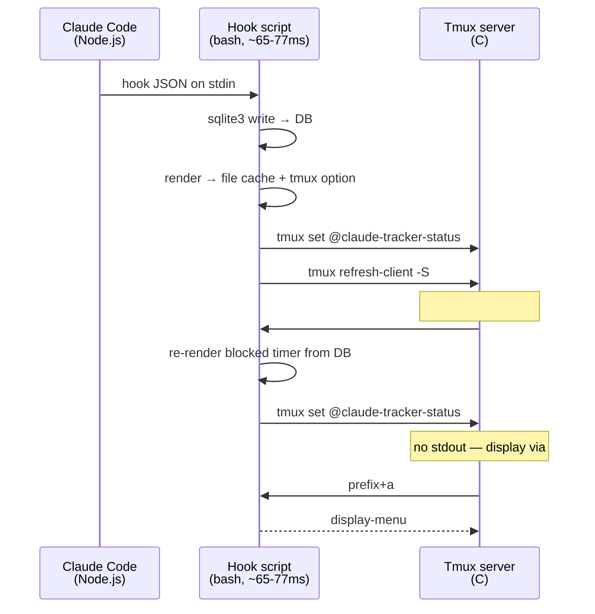
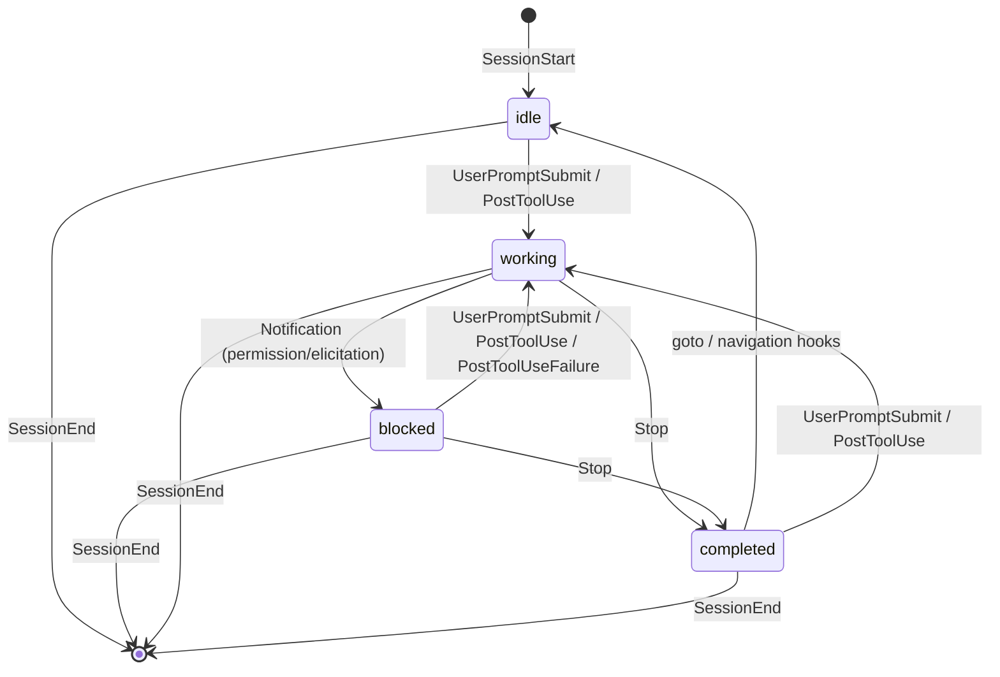

# Architecture

## Process Boundaries



No daemon. Each hook is a fire-and-forget bash process. SQLite is the only shared state.

## Push/Pull Split

**Push (hooks):** Claude event -> write DB -> render to file cache + tmux option -> `refresh-client -S`. The status is pushed to `@claude-tracker-status` via `tmux set`, and `#{@option}` in status-right is re-evaluated immediately on refresh. This eliminates the lag caused by `#()` caching.

**Pull (refresh):** Tmux calls `#(tracker.sh refresh)` every `status-interval` seconds. Re-queries DB (blocked timer recomputation), updates the tmux option. Produces no stdout — display comes from `#{@claude-tracker-status}`.

**Why not `#()`?** Tmux caches `#()` command output for `status-interval` seconds. `refresh-client -S` redraws the status line but does NOT re-evaluate `#()` — it uses the cached output. This caused up to `status-interval` seconds of lag between hook execution and visible status change. Switching to `#{@option}` (a tmux user option) eliminates this because option values are read fresh on every redraw.

Cache file write uses `mv -f` for atomicity. The tmux option is the primary display source; the file cache is a fallback.

## State Machine



Transition guards:
- `SessionStart` -> idle (INSERT OR IGNORE, no-op if session exists)
- `Stop` -> completed (`WHERE status IN ('working', 'blocked')`, no-op on idle/completed; auto-cleared to idle on next refresh if user is viewing the pane)
- `UserPromptSubmit` -> working (unconditional, handles idle/completed/blocked->working)
- `PostToolUse` / `PostToolUseFailure` -> working (`WHERE status!='working'`, no-op when already working)
- `Notification` -> blocked (`WHERE status = 'working'`, only from working state; `permission_prompt` or `elicitation_dialog` only)
- `goto` -> idle (`WHERE status='completed'`, clears completed when user focuses pane via menu)
- `session-window-changed` / `window-pane-changed` -> idle (`WHERE status='completed' AND tmux_pane=<focused_pane>`, clears completed when user navigates to pane)

## Completed Auto-Clear

Completed (`+`) auto-clears to idle when the user is viewing the pane. Three mechanisms:

1. **Navigation hooks** (immediate): `session-window-changed`, `window-pane-changed`, `client-session-changed` fire `cmd_pane_focus` which clears completed on the focused pane.
2. **Menu goto** (immediate): `cmd_goto` clears completed when jumping to a pane.
3. **Refresh cycle** (periodic): `cmd_refresh` spawns `pane-focus` for the active pane every `status-interval` seconds.

### Grace period

The refresh-cycle auto-clear uses a grace period to prevent completed from being invisible. Without it, `cmd_refresh` would clear completed on the same refresh cycle it first rendered — the user would never see the `+` indicator.

The grace period works by checking `updated_at` against the current time:

```sql
SELECT 1 FROM sessions WHERE status='completed'
    AND updated_at <= unixepoch() - $grace LIMIT 1;
```

`$grace` is read from tmux's `status-interval` (typically 15s). A completed session must have been in that state for at least one full refresh interval before `pane-focus` is triggered. This guarantees the `+` indicator is visible for at least one refresh cycle.

Navigation hooks (mechanism 1-2) bypass the grace period — explicit user navigation always clears immediately.

## Hook Performance

State-changing hooks run in ~77ms. No-op hooks (e.g. PostToolUse when already working) run in ~65ms.

### Hot path optimizations

PostToolUse and Notification are the most frequent state-changing hooks. They use a combined SQL pattern that does UPDATE + render query in a single sqlite3 call:

```sql
UPDATE sessions SET status='...', updated_at=unixepoch()
    WHERE session_id='...' AND status != '...';
SELECT CASE WHEN changes() = 0 THEN '' ELSE (render query) END;
```

If `changes() = 0`, the hook is a no-op — skip render, skip tmux refresh.

These hooks also skip `_ensure_session` (the session is guaranteed to exist by the time PostToolUse or Notification fires). This eliminates 2 sqlite3 calls from the hot path.

### Config loading

`load_config` (helpers.sh) fetches tmux options and caches them to `$TRACKER_DIR/config_cache`. The full check runs `date` + `stat` to verify freshness (~8ms in subprocesses).

Hook path uses `_load_config_fast` which sources the cache file directly without freshness check. Non-hook paths (status-bar, menu) use the full `load_config` with 60s TTL.

### Cost breakdown (state-changing hook)

| Cost | Source |
|------|--------|
| ~7ms | bash startup + source helpers.sh |
| ~9ms | sqlite3 (combined UPDATE + render) |
| ~5ms | source config cache |
| ~6ms | write cache file (printf + mv) |
| ~3ms | tmux set @claude-tracker-status |
| ~7ms | tmux refresh-client -S |

### Status-interval enforcement

The plugin sets `status-interval` to `@claude-tracker-status-interval` (default 5s) on load, but only lowers it — never overrides a user's shorter custom interval. This ensures the blocked timer refreshes periodically while respecting user preferences.

### Known upstream limitations

The tracker processes hooks in ~77ms. Perceived latency comes from Claude Code's hook dispatch:

**Notification hook delay (blocked detection):** The `Notification` hook has a confirmed multi-second delay (1-45s) between Claude needing permission and firing the hook. This makes blocked detection feel slow or intermittent. The gap is inside Claude Code's event-to-hook invocation pipeline, not in script execution. Reported in Claude Code issues [#19627](https://github.com/anthropics/claude-code/issues/19627), [#23383](https://github.com/anthropics/claude-code/issues/23383), [#5186](https://github.com/anthropics/claude-code/issues/5186). No fix available — this is outside the tracker's control.

**PostToolUse reliability:** PostToolUse hooks sometimes never fire at all ([#6305](https://github.com/anthropics/claude-code/issues/6305)). When this happens, the session stays `idle` after `SessionStart` because no hook transitions it to `working`. Subsequent `Notification` hooks are then dropped by the `status='working'` guard, causing missed blocked detection.

**Asymmetric transition latency:** `blocked -> working` (PostToolUse) feels faster than `working -> blocked` (Notification) despite identical script execution times. This is entirely due to the upstream Notification delay described above.

**Stop hook:** Most reliable and lowest-latency of all hooks. Completed detection is not affected by upstream issues.

**No timing guarantees:** Claude Code provides no SLA on hook dispatch latency. The <100ms expectation is a user-stated desired behavior, not an official guarantee.

### What was eliminated

| Removed | Savings |
|---------|---------|
| `jq` (5 calls per hook) | ~15ms (subprocess spawns) |
| `cat` for stdin | ~3ms (replaced with `read -r`) |
| `_ensure_session` on hot path | ~7ms (1 fewer sqlite3) |
| Separate render sqlite3 call | ~8ms (batched into hook SQL) |
| `date`+`stat` in config check | ~8ms (source file directly) |
| render+refresh on no-ops | ~15ms (skip via `SELECT changes()`) |

## Self-Healing (_ensure_session)

Called for session-creating hooks (SessionStart, UserPromptSubmit). Registers the session if missing, backfills tmux pane data if incomplete. Accepts an initial status parameter: SessionStart creates as `idle`, UserPromptSubmit creates as `working`.

Hot-path hooks (PostToolUse, Notification, Stop, TeammateIdle) skip this — their UPDATEs are safe no-ops if the session doesn't exist yet.

Handles: missed SessionStart, lost tracking, missing tmux info.

- `SessionStart`: `INSERT OR REPLACE` (authoritative upsert)
- `_ensure_session`: `INSERT OR IGNORE` (gap-fill only)

## Session Cleanup

Sessions can leak (crashes, killed panes). Three cleanup mechanisms:

1. **SessionEnd hook** (normal exit)
2. **`_reap_dead`** (hook path, throttled to 30s): cross-references `tmux list-panes` with stored pane IDs, deletes dead ones
3. **`cmd_cleanup`** (manual): deletes sessions older than 24h + dead pane check

`_reap_dead` checks pane liveness via `tmux list-panes` and process inspection via `pgrep`. Working/blocked sessions on live panes without a claude child process are cleaned up (Ctrl+C case).

## SQLite as IPC

Multiple concurrent hook processes. WAL mode handles this:

- **WAL mode**: readers never block writers
- **busy_timeout=100ms**: concurrent writes wait instead of failing
- Each `sqlite3` invocation is a new connection

## Scan (Fallback Discovery)

`cmd_scan` finds Claude processes via `pgrep` in tmux panes. Conditional INSERT skips panes already tracked by hooks. Throttled to once per 30s.

## Hook Events

| Hook | Transition | Guard |
|------|-----------|-------|
| SessionStart | (new) -> idle | INSERT OR IGNORE (no-op if session exists) |
| UserPromptSubmit | any -> working | unconditional |
| PostToolUse | blocked/idle/completed -> working | `status!='working'` |
| PostToolUseFailure | blocked/idle/completed -> working | `status!='working'` (catches rejected tools / interrupts) |
| Stop | working/blocked -> completed | `status IN ('working', 'blocked')` |
| session-window-changed / window-pane-changed / client-session-changed | completed -> idle | `status='completed'` AND `tmux_pane` matches focused pane |
| Notification | working -> blocked | `status='working'`, `permission_prompt` or `elicitation_dialog` only |
| SessionEnd | any -> (deleted) | unconditional |
| TeammateIdle | any -> idle | unconditional |

**Why `PostToolUseFailure`?** Claude Code's `Stop` hook does not fire on user interrupt. If a user rejects a permission prompt and interrupts, the session stays stuck at `blocked` with no hook to clear it. `PostToolUseFailure` fires on tool rejection/failure and transitions `blocked` back to `working`, where `_reap_dead` can clean up.

**Why `permission_prompt|elicitation_dialog` matcher on Notification?** The `Notification` hook fires for multiple types: `permission_prompt`, `elicitation_dialog`, `idle_prompt`, `auth_success`. Both `permission_prompt` and `elicitation_dialog` mean Claude is waiting for user input. Without the filter, an `idle_prompt` notification would incorrectly show the session as blocked.

## Configurable Icons

Status icons are configurable via tmux options:

| Option | Default | Description |
|--------|---------|-------------|
| `@claude-tracker-icon-idle` | `.` | Idle session indicator |
| `@claude-tracker-icon-working` | `*` | Working session indicator |
| `@claude-tracker-icon-completed` | `+` | Completed session indicator |
| `@claude-tracker-icon-blocked` | `!` | Blocked session indicator |

Icons are loaded into `ICON_*` vars via `load_config` and cached alongside colors. `_write_cache` and `cmd_menu` use `${ICON_*:-default}` with fallbacks, so unset vars produce the original display.

## State Transition Hooks

User-defined commands that fire on state transitions:

| Option | Fires on |
|--------|----------|
| `@claude-tracker-on-working` | any -> working |
| `@claude-tracker-on-completed` | any -> completed |
| `@claude-tracker-on-blocked` | any -> blocked |
| `@claude-tracker-on-idle` | any -> idle |
| `@claude-tracker-on-transition` | every transition (catch-all) |

Each command receives: `$1=from_status $2=to_status $3=session_id $4=project_name`

### Performance

A precomputed `_HAS_HOOKS` flag in the config cache. When no hooks configured: zero cost (single string comparison, early return). When hooks configured:

- **Hot-path** (PostToolUse, Notification): one extra `SELECT status` prepended to the batched sqlite3 call (~0ms overhead, same process)
- **Non-hot-path** (UserPromptSubmit, Stop, TeammateIdle): one extra sqlite3 call (~5ms)
- **Hook execution**: background subshell, non-blocking (`($cmd "$@" &)`)

### Firing locations

- `cmd_hook` — after render, before returning. Compares `__old_status` (captured by each `_hook_*` function) against the new status.
- `cmd_goto` / `cmd_pane_focus` — fires `completed -> idle` after UPDATE.

## Commands

| Command | Purpose |
|---------|---------|
| `tmux-claude-agent-tracker init` | Create DB |
| `tmux-claude-agent-tracker hook <event>` | Handle Claude hook (stdin JSON) |
| `tmux-claude-agent-tracker status-bar` | Output cached status string |
| `tmux-claude-agent-tracker refresh` | Re-render from DB, update tmux option (no output) |
| `tmux-claude-agent-tracker menu [page]` | Show agent menu |
| `tmux-claude-agent-tracker goto <target>` | Jump to pane |
| `tmux-claude-agent-tracker pane-focus <pane_id>` | Clear completed status on focused pane |
| `tmux-claude-agent-tracker scan` | Discover untracked Claude processes via pgrep |
| `tmux-claude-agent-tracker cleanup` | Remove stale sessions |

## Install Architecture

Three install paths, all converge on the same result:

### Manual (`./install.sh`)

Full setup: CLI symlinks + DB init + tmux.conf line + Claude Code hooks + skill file.

### TPM (`prefix + I`)

TPM clones the repo and runs `claude-tracker.tmux`. The `.tmux` entry point auto-provisions:
- CLI symlinks (idempotent, only recreated if missing or pointing elsewhere)
- Skill file (only copied if source differs from destination via `cmp -s`)
- DB init

User only needs one manual step: `./install.sh --hooks-only` to configure Claude Code hooks in `~/.claude/settings.json`.

### Hooks-only (`./install.sh --hooks-only`)

Skips CLI/DB/tmux.conf setup, only configures Claude Code hooks. Used after TPM install or to re-run hook configuration.

## Uninstall

`./uninstall.sh` reverses all install artifacts:

1. CLI symlinks (`~/.local/bin/tmux-claude-agent-tracker`, `claude-agent-tracker`)
2. tmux.conf plugin lines (comment + run-shell line)
3. Claude Code hooks (jq filter removes entries matching `tmux-claude-agent-tracker`)
4. Skill file (`~/.claude/skills/tmux-claude-agent-tracker/`)
5. Data directory (`~/.tmux-claude-agent-tracker/`)
6. Live tmux state: status-right injection, tmux hooks, options, key binding

## Testing

```bash
bats tests/
```

Two test suites:

- **`tests/tracker.bats`** (~110 tests): Unit tests with mocked tmux. Each test gets a fresh temp DB via `setup_test_env`. Tests source tracker functions directly (stripping shebang/main) via `source_tracker_functions`. Tmux calls are stubbed to no-ops or value captures.
- **`tests/integration.bats`** (~20 tests): End-to-end tests that invoke `tracker.sh` as a subprocess, piping real hook JSON on stdin. Tests concurrent hooks, parallel session creation, and cache consistency. Use a leak guard that fails if the production DB is modified.

Key test helpers (`tests/helpers.bash`):
- `insert_session`: Direct SQL insert with optional status, pane, timestamp
- `source_tracker_functions`: Evals tracker.sh with mocked externals (tmux, git, load_config)
- `count_status` / `get_status` / `count_sessions`: Query helpers

## Database Schema

```sql
CREATE TABLE sessions (
    session_id    TEXT PRIMARY KEY,
    status        TEXT NOT NULL DEFAULT 'working'
        CHECK(status IN ('working', 'blocked', 'idle', 'completed')),
    cwd           TEXT NOT NULL,
    project_name  TEXT NOT NULL,
    git_branch    TEXT,
    prompt_summary TEXT,
    agent_type    TEXT,
    tmux_pane     TEXT,
    tmux_target   TEXT,
    started_at    INTEGER NOT NULL DEFAULT (unixepoch()),
    updated_at    INTEGER NOT NULL DEFAULT (unixepoch())
);
```

## File Structure

```
tmux-claude-agent-tracker/
├── claude-tracker.tmux          # TPM entry point
├── scripts/
│   ├── helpers.sh               # Config loading, tmux helpers
│   └── tracker.sh               # Core: hook, menu, status-bar, goto
├── tests/
│   ├── tracker.bats             # Unit tests (mocked tmux)
│   ├── integration.bats         # End-to-end tests (real subprocess)
│   ├── helpers.bash             # Unit test helpers, DB setup, mocks
│   └── integration_helpers.bash # Integration test helpers, leak guard
├── install.sh                   # TPM + manual install
├── uninstall.sh                 # Full artifact removal
├── bin/
│   ├── tmux-claude-agent-tracker    # CLI wrapper -> scripts/tracker.sh
│   └── claude-agent-tracker         # Short alias wrapper
└── .claude/skills/
    └── tmux-claude-agent-tracker/
        └── SKILL.md             # Claude Code skill reference (copied to ~/.claude/skills/)
```
